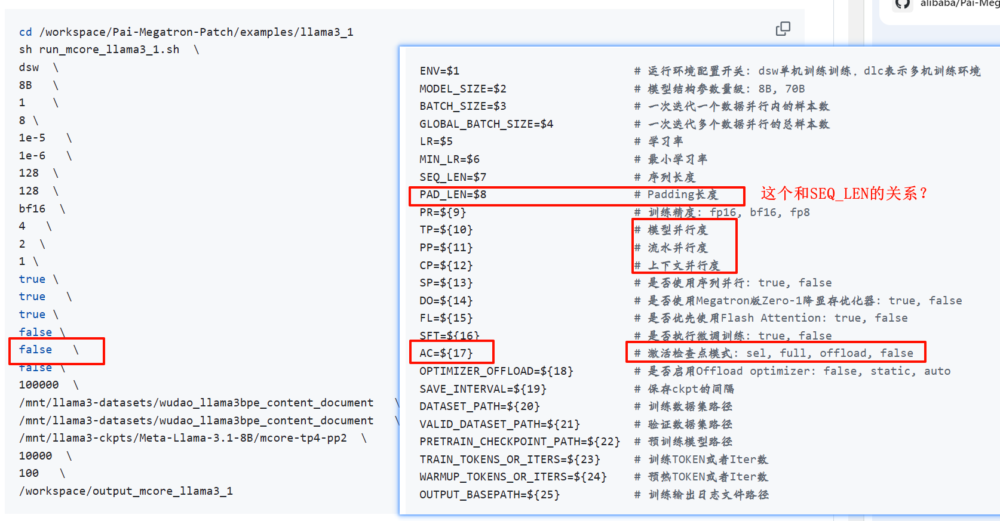

<center>11-07 周四 从Pai-megatron-patch中生成llama3.1启动脚本.md</center>

| 时间                  | 版本 | 修改人 | 描述     |
| --------------------- | ---- | ------ | -------- |
| 2024年11月7日10:50:40 | V0.1 | 宋全恒 | 新建文档 |
|                       |      |        |          |
|                       |      |        |          |

# 简介

## 容器启动

```bash
docker run --name songquanheng-power-test --privileged --shm-size=128gb --cap-add=ALL --pid=host -v /mnt/nas_
v2/common/public/dataset/seed/tokens/tokens:/data/tokens  --ipc=host --network=host  --device=/dev/infiniband -it 10.200.88.53/framework/pai-mega
tron:torch24.07-py3-v6.1 tail
```


## Pai-megatron-Patch


## llama3.1B

[Pai-Megatron-Patch/examples/llama3_1/README.md at main · alibaba/Pai-Megatron-Patch](https://github.com/alibaba/Pai-Megatron-Patch/blob/main/examples/llama3_1/README.md#Megatron-Core-Dense%E6%A8%A1%E5%9E%8B%E8%AE%AD%E7%BB%83%E6%B5%81%E7%A8%8B)

# 步骤

## 生成mmap数据集

```bash

# 请在此处设置数据集路径和工作路径
export dataset_dir=/public/dataset/qwen-datasets
export output_dir=/public/dataset/llama3-datasets
export WORK_DIR=/mnt/self-define/songquanheng

# 分别为训练集、验证集生成mmap格式预训练数据集
cd ${WORK_DIR}/Pai-Megatron-Patch/toolkits/pretrain_data_preprocessing
bash run_make_pretraining_dataset.sh \
../.. \
${dataset_dir}/cleaned_zst/ \
llamabpe \
${output_dir}/ \
/public/model/Meta-Llama-3.1-8B/ 

```


## 启动单机训练



### llama3.1-8B

```bash
sh run_mcore_llama3_1.sh  \
dsw  \
8B   \
1    \
1024 \
1e-5   \
1e-6   \
8192  \
8192  \
bf16  \
1   \
2  \
1 \
true \
true   \
true \
false \
false   \
false \
100000  \
/public/dataset/llama3-datasets/wudao_llama3bpe_content_document   \
/public/dataset/llama3-datasets/wudao_llama3bpe_content_document   \
/public/model/Meta-Llama-3.1-8B  \
100000000000  \
100000000   \
/mnt/self-define/songquanheng/llama3.1-70B/output
```


BF16  29974MiB

```bash
 [2024-11-07 04:38:18] iteration       12/   11920 | consumed samples:        12288 | elapsed time per iteration (ms): 307693.8 | throughput per GPU (TFLOP/s/GPU): 197.4 | learning rate: 1.000000E-05 | global batch size:  1024 | lm loss: 1.026110E+01 | loss scale: 1.0 | grad norm: 7.323 | number of skipped iterations:   0 | number of nan iterations:   0 |
 [2024-11-07 04:43:25] iteration       13/   11920 | consumed samples:        13312 | elapsed time per iteration (ms): 307874.3 | throughput per GPU (TFLOP/s/GPU): 197.2 | learning rate: 9.999999E-06 | global batch size:  1024 | lm loss: 1.013527E+01 | loss scale: 1.0 | grad norm: 4.542 | number of skipped iterations:   0 | number of nan iterations:   0 |
 [2024-11-07 04:48:33] iteration       14/   11920 | consumed samples:        14336 | elapsed time per iteration (ms): 307277.9 | throughput per GPU (TFLOP/s/GPU): 197.6 | learning rate: 9.999999E-06 | global batch size:  1024 | lm loss: 1.021958E+01 | loss scale: 1.0 | grad norm: 18.496 | number of skipped iterations:   0 | number of nan iterations:   0 |
 [2024-11-07 04:53:40] iteration       15/   11920 | consumed samples:        15360 | elapsed time per iteration (ms): 307538.9 | throughput per GPU (TFLOP/s/GPU): 197.5 | learning rate: 9.999997E-06 | global batch size:  1024 | lm loss: 1.011892E+01 | loss scale: 1.0 | grad norm: 12.726 | number of skipped iterations:   0 | number of nan iterations:   0 |
 [2024-11-07 04:58:48] iteration       16/   11920 | consumed samples:        16384 | elapsed time per iteration (ms): 307437.1 | throughput per GPU (TFLOP/s/GPU): 197.5 | learning rate: 9.999996E-06 | global batch size:  1024 | lm loss: 9.985525E+00 | loss scale: 1.0 | grad norm: 3.034 | number of skipped iterations:   0 | number of nan iterations:   0 |
```


TP 2 PP 2 内存 45328MiB FLOPS  FLOPS212

```bash
[2024-11-08 06:23:29] iteration        1/   11920 | consumed samples:         1024 | elapsed time per iteration (ms): 316180.0 | throughput per GPU (TFLOP/s/GPU): 192.1 | learning rate: 9.090909E-07 | global batch size:  1024 | lm loss: 1.189170E+01 | loss scale: 1.0 | grad norm: 28.060 | number of skipped iterations:   0 | number of nan iterations:   0 |
 [2024-11-08 06:28:23] iteration        2/   11920 | consumed samples:         2048 | elapsed time per iteration (ms): 294439.5 | throughput per GPU (TFLOP/s/GPU): 206.2 | learning rate: 1.818182E-06 | global batch size:  1024 | lm loss: 1.189131E+01 | loss scale: 1.0 | grad norm: 27.421 | number of skipped iterations:   0 | number of nan iterations:   0 |

 [2024-11-08 06:33:10] iteration        3/   11920 | consumed samples:         3072 | elapsed time per iteration (ms): 286552.2 | throughput per GPU (TFLOP/s/GPU): 211.9 | learning rate: 2.727273E-06 | global batch size:  1024 | lm loss: 1.180501E+01 | loss scale: 1.0 | grad norm: 28.002 | number of skipped iterations:   0 | number of nan iterations:   0 |
```


```bash
sh run_mcore_llama3_1.sh  \
dsw  \
8B   \
1    \
32 \
1e-5   \
1e-6   \
64  \
6  \
bf16  \
1   \
2  \
1 \
true \
true   \
true \
false \
false   \
false \
100000  \
/public/dataset/llama3-datasets/wudao_llama3bpe_content_document   \
/public/dataset/llama3-datasets/wudao_llama3bpe_content_document   \
/public/model/Meta-Llama-3.1-8B-tokenizer  \
100000000000  \
100000000   \
/mnt/self-define/songquanheng/llama3.1-70B/output
```


### llama3.1-70B

```bash
bash run_mcore_llama3_1.sh  \
dsw  \
70B   \
1    \
1024 \
1e-5   \
1e-6   \
8192  \
8192  \
bf16  \
4   \
2  \
1 \
true \
true \
true \
false \
false   \
false \
1000  \
/public/dataset/qwen-datasets/wudao_qwenbpe_content_document   \
/public/dataset/qwen-datasets/wudao_qwenbpe_content_document   \
/public/model/Meta-Llama-3.1-70B-  \
100000000000  \
100000000   \
/mnt/self-define/songquanheng/llama3.1-70B/output
```


